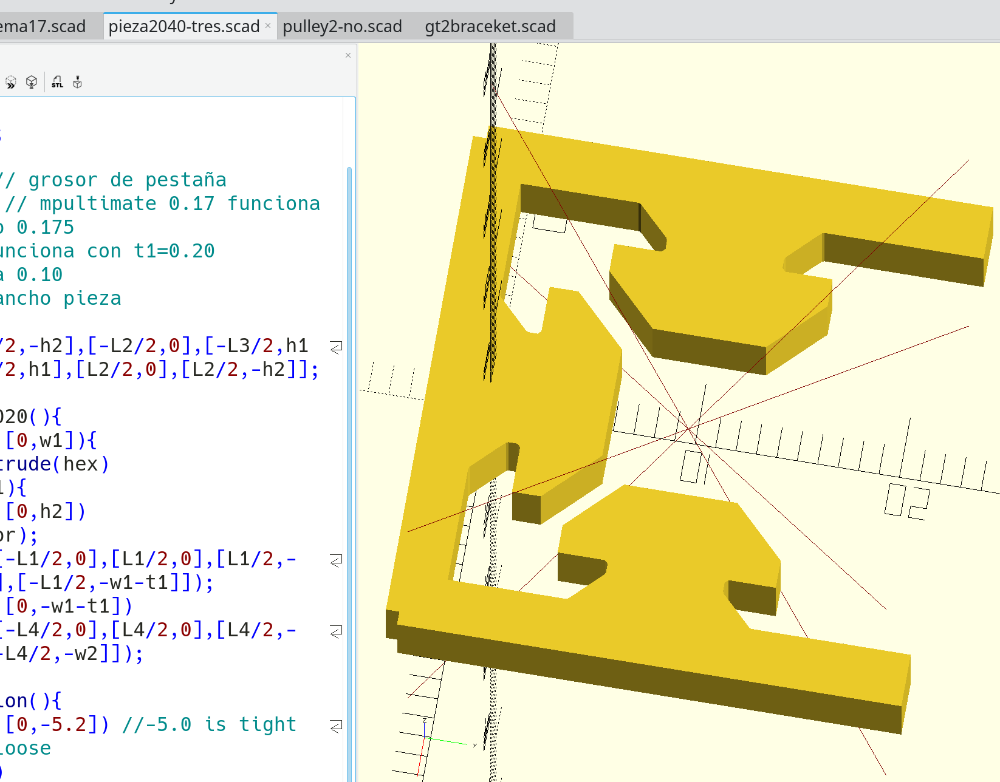
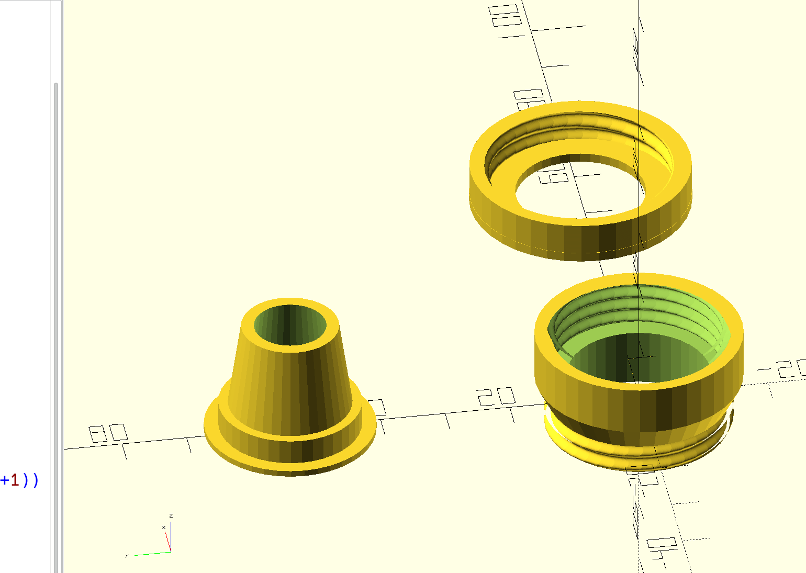
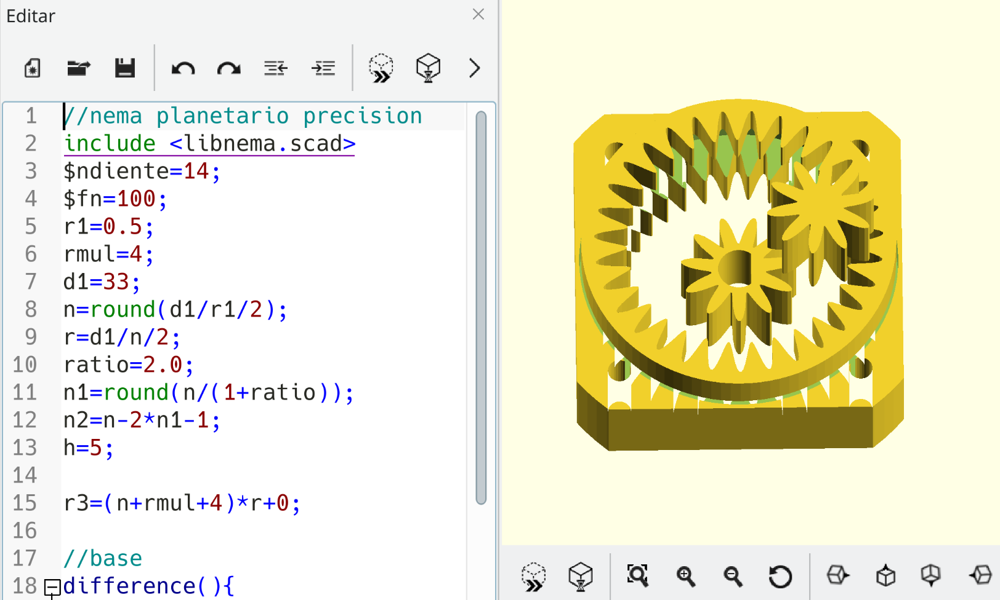
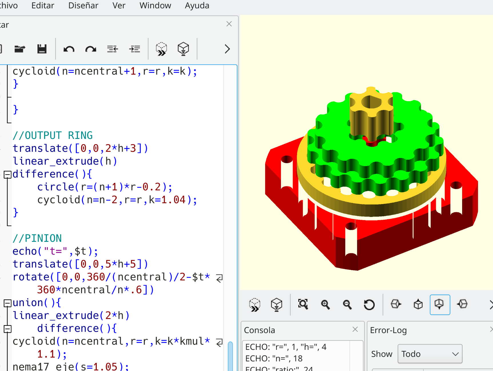
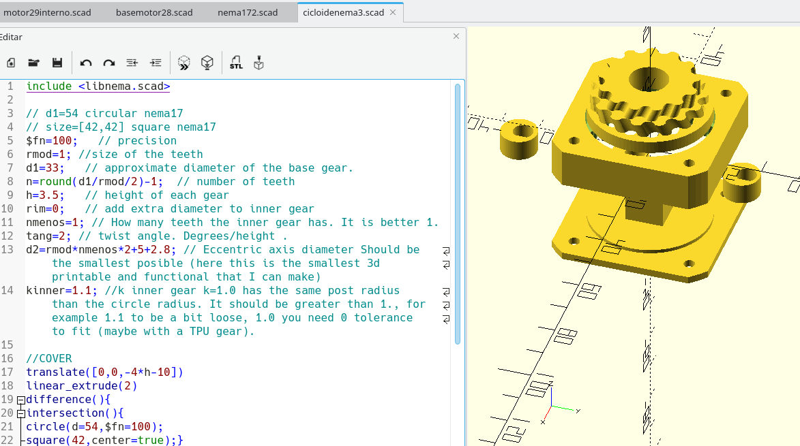
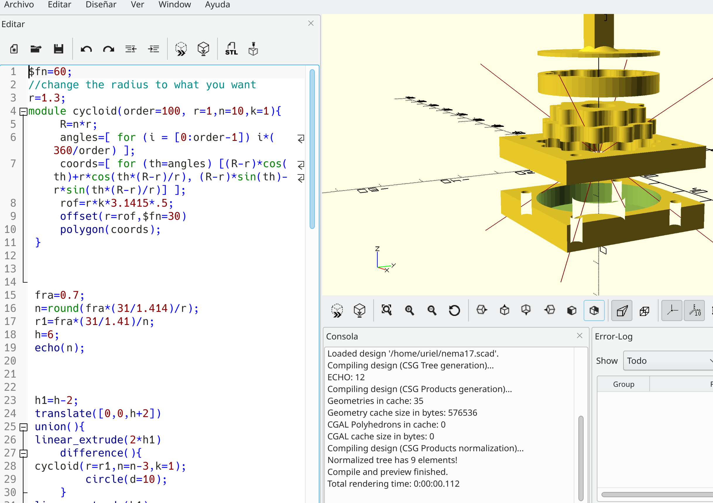
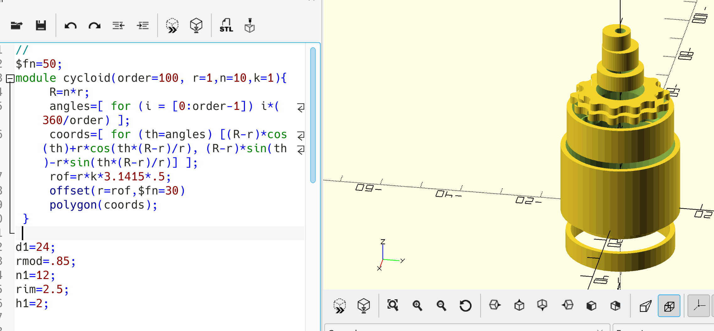

# OpenSCAD
2020 profile slider

https://youtube.com/shorts/6cmPWXfh2tU
## Reduced with multiplier
This idea came after a youtube video I cannot remember and the trochoidal pump.
File: pump03.scad

## Garden Hose Adapter
manguera03.scad + manguera03.stl (Manguera) hose in spanish.
TPU and PLA is needed.
Print the threaded parts with PLA and the other with TPU.
Follow the instructions in the video:
 
<picture>

</picture>
## Telescope reducer based in planetary 'precision' gearbox.
Download: nemaplanetario0.55twist.scad nemaplanetario0.55twist.stl

Video:

## Planetary 'precision' gearbox.
It is a split ring/composed planetary gearbox.
It is 50:1.
It is intended for precision, but we must optimize it before it achieves truly precision.

files: nemaplanetariot.scad nemaplanetariot.stl

OpenSCAD:
<picture>

</picture>

3D printed:

## Cycloidal gearbox with pinion multiplier.
I've seen some youtube video that inspired this reducer.
You introduce a small cycloidal gear in the motor axis and the effect is to multiply the number of teeth that the inner gear makes every cycle by the teeth number of this pinion.

File: smallredu-00.scad smallredu-00.stl

<picture>

</picture>

The key idea is shown in this video:

3D printed version:

## New compound cycloidal-helical gearbox 
Improved version. Helical cycloidal gears.

* Reduction ratio is caculated by n*(n-2)/2:1
* Smoother movement.
* Lesser noise.
* Looks great.

OpenSCAD file: cicloidalnema3.scad libnema.scad
STL file: cicloidalnema3.stl
<picture>

</picture>

Torque test:

<h2> Nema17 cycloidal Gearbox</h2>
Nema17.scad  has code to create a double gear and a nema17 base.

<picture>
  
</picture>

<h2> Circular Motor Cycloidal Gearbox.</h2>
This is a simple design and effective cycloidal gearbox for big and small motors.
It has only 7 pieces, no bearings, no metalic parts, fully 3d printed.
Download motor25.scad

Edit it to fit your motor.
Reduction ratio is calculated by n1*(n1-2)/2:1
where n1 is the number of theet of the greatest gear.

<picture>
  
</picture>

<h2> Precision gearbox for Nema17 </h2>
This gearbox is intended not for high torque but for precision.
The maximum backslash is +-1/4 of tooth (2° approximately) at very high torque.
Maybe can be reduced with tighter tolerances. 
Only 5 pieces, no metallic pieces, bolts,screws, nuts.
The ring is printed with TPU.
<picture>
  
</picture>

